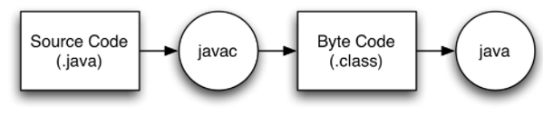

# 자바

### 자바의 변천사

----------------------------

#### 자바의 탄생
- 1995년 제임스 고슬링에 의해 개발되 어 공개
- 가상머신이라는 개념으로 플랫폼 독립적인 구현이라는 당시로 참신한 접근
- 객체지향 개념과 개발 문화 확산에 기여
- 인터넷과 웹의 발전과 함께 발전

#### 서블릿과 JSP
- 1997년 공식발표, 자바에서 웹프로그램 개발을 지원
- 인터넷의 성장과 함께 서블릿은 자바의 대표적인 구현 분야 됨
- JSP는 서블릿 응용 기술로 웹화면에 자바코드를 사용해 웹프로그램 개발 효율을 높임
- 웹개발의 기본기술이었으나 수년전부터 프론트엔드 기반 개발과 백엔드 개발환경 변화등으로 직접적인 사용 비율 낮아짐

#### 이클립스
- 1999년 IBM이 개발해 오픈소스로 기증한 자바 기반의 통합 개발 도구 플랫폼
- 자바 성장에 크게 기여했으며 자바의 기본 통합 개발도구로 자리잡음
- 이클립스 자체는 자바 이외의 언어 개발도 지원하는 개발 플랫폼 개념
- Intellij로 많은 사용자들이 이동

#### 모바일 인터넷
- 2000년대 초중반 휴대폰 보급 확산과 함께 모바일 인터넷 적용시도
- 자바 가상머신 탑재. -> 낮은 사양과 느린 인터넷 속도등으로 크게 성장 X

#### 스프링프레임워크
- 2004년 1.0발표 2021년 현재 5.X버전 이며 스트링붙트로 인해 개발이 간소화됨
- 대규모시스템 개발에 적합한 오픈소스 프레임워크로 자바의 성장에 큰 역할을 함
- 많은 백엔드 시스템 구현에 스프링프레임워크가 사용되고 특히 우리나라의 경우 활용도가 높음
- 공공 개발에 요구되는 전자정부 프레임워크도 스프링 기반

#### 상용화
- 2019년 부터 자바의 상용화가 시작 되었지만 목적의 경우 계속 무료로 사용할 수 있음
- 임베디드, 상업용, 업무용 목적의 경우 별도 라이센스 필요
- 기업에서 무료로 자바 사용하려면 OpenJDK를 사용해야함
- 자바 공식 버전은 11이며 LTS의 첫버전으로 2023년 9월까지 지원됨

 
 

### 자바 바이트코드

------------------

바이트코드: 자바 컴파일러가 생성하는 코드로 특정 하드웨어에서 직접 실행할 수 있는 기계어가 아니라 자바 가상 머신에 의해 해석될 수 있는 일종의 중간 코드 개념

 

### 자바 가상머신

-----------------------

- 자바의 가장 큰 특징

가상머신: 소프트웨어로 구현된 기계장치를 말하는 것으로 자바 이전에 OAK라는 프로젝트에서 다양한 가전제품에서 구동될 수 있는 소프트웨어 개발을 위해 고안된 아이디어

*가상머신의 특징으로 인해 특정 하드웨어나 운영체제에 영향을 받지 않고 동일한 프로그램의 개발이 가능해짐*

 

### 초기 자바의 모토: WORA

-------------------

#### JVM
: 자바의 가장 큰 특징. 특정 운영체제에 종속되지 않고 동일한 프로그램 개발과 실행이 가능한 기술

- 자바소스는 컴파일 후 바이트코드가 생성되며 JVM은 바이트코드를 해석해 운영체제에서 실행할 수 있도록 번역해주는 역할을 담당

- 가상머신 개념은 윈도우 .Net플랫폼에도 영향을 미쳤으며 최근에는 Kotlin, Scala, Clojure, Groovy등 JVM기반의 언어들 유행

- 언어의 문접구조는 다르지만 모두 자바와 같은 바이트코드를 생성해 JVM에서 실행 가능

#### 자바 플랫폼

- 플랫폼: API과 가상머신. 특정 자바 프로그램이 실행되는 환경으로 Java SE, Java EE, Java ME등이 있음
- 각 영역에 특화된 자바 플랫폼이 있음
- JDK, JRE ,API 중요
- 실행환경에 따라 API구성등이 다름
- 일반적으로 Java SE사용, 대규모 개발은 Java EE
    - Java EE: GlassFish라고 하는 참조구현 만 제공되고 실제 제품은 오라클, IBM등 관련 기업에 의해 구현되어 배포/판매
- 스프링 프레임워크등 오픈소스 프레임워크의 성장으로 인해 Java EE시장은 축소, 오라클은 Java EE를 이클립스 재단으로 이관

 

#### JDK

---------------------

- 자바 프로그램을 개발하기 위한 개발킷, 컴파일러와 디버거등이 포함됨
- 자바프로그램을 실행하기 위해서는 JRE만으로도 가능
- 통합개발환경을 사용해도 JDK 필요

 
 

### 자바 활용 분야

---------------------

많은 웹서비스의 백엔드 개발에 주로 사용

서블릿, JSP, 스프링프레임워크등이 대표적

PC용 GUI프로그램 개발보다는 서버측에서 돌아가는 프로그램 개발에 많이 사용
-> 처리속도가 느리기때문

- 인터넷 포탈, 인터넷 뱅킹, 쇼핑몰, SNS 플랫폼등의 백엔드 서비스 개발
- 고도의 성능과 안정성, 보안이 요구되는 기업 시스템 개발에 널리 사용
- 안드로이드 대표 개발언어
- 빅데이터, 머신러닝등 인공지능 기반기술들에 자바 기반 소프트웨어들이 널리 사용됨